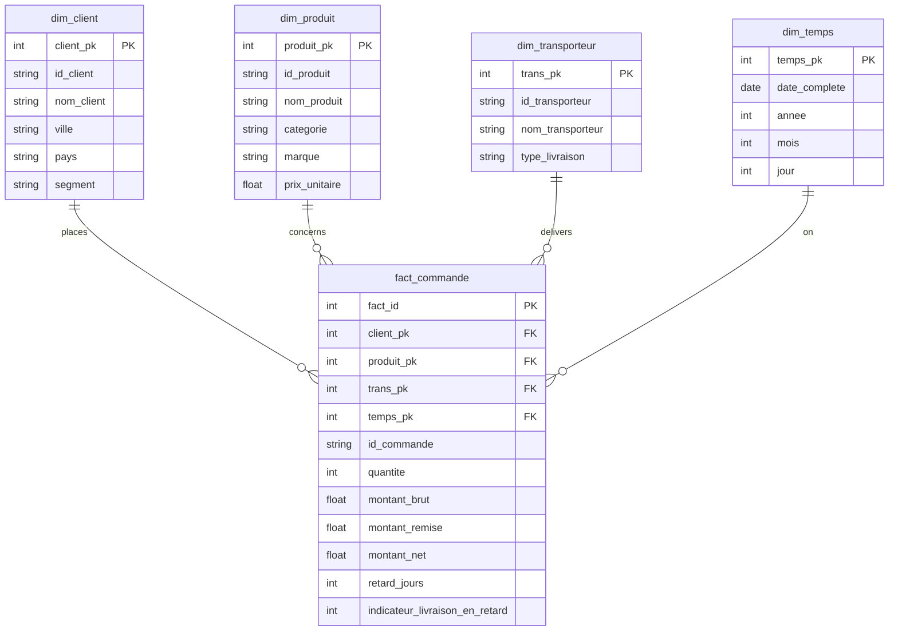

# E-Commerce analysis BI project

This project centralizes and models data from an e-commerce platform to
provide visibility into commercial performance and operational logistics.

## Technical environment

- Operating System: Fedora 44
- Database: PostgreSQL (Docker)
- ETL Tool: Pentaho Data Integration (Spoon 11)
- Visualization: Metabase

## Business requirements and metrics

The solution implements eight fundamental key performance indicators:

- Total revenue: The sum of net amounts for all sales.
- Total orders: The global volume of recorded transactions.
- Total quantity sold: The cumulative number of product units sold.
- Average basket value: The mean financial value of an order.
- Revenue by category or city: Distribution of value across product and
  client axes.
- Cancellation rate: The proportion of orders that do not complete.
- Late delivery rate: The ratio of orders where the actual delivery date
  exceeds the scheduled date.
- Average delivery delay: The mean number of days for delayed deliveries.

## Data warehouse design

The project uses a star schema model to optimize query performance in
Metabase.

### Logical schema

## ETL implementation with Pentaho

### Dimension loading

Transformations extract data from CSV files, apply cleaning processes, and
load the data into PostgreSQL.

### Fact table loading

The fact table transformation performs integrity joins and business
calculations:
- Net amount = (Quantity * Unit Price) - Discount
- Delay = Actual Date - Scheduled Date

## Strategic recommendations

- Logistics: Renegotiate contracts with carriers showing high delay rates.
- Marketing: Prioritize high-revenue segments like Information Technology and
  Telephony.
- Conversion: Analyze order cancellations to optimize inventory management.

## Project structure

- `data/`: Source CSV files.
- `etl/`: Pentaho transformations and jobs.
- `sql/`: Database creation scripts.
- `docs/`: Documentation and supplemental images.

Authored by Youssef Fellah.
Developed for the Engineering Cycle at Mundiapolis University.
