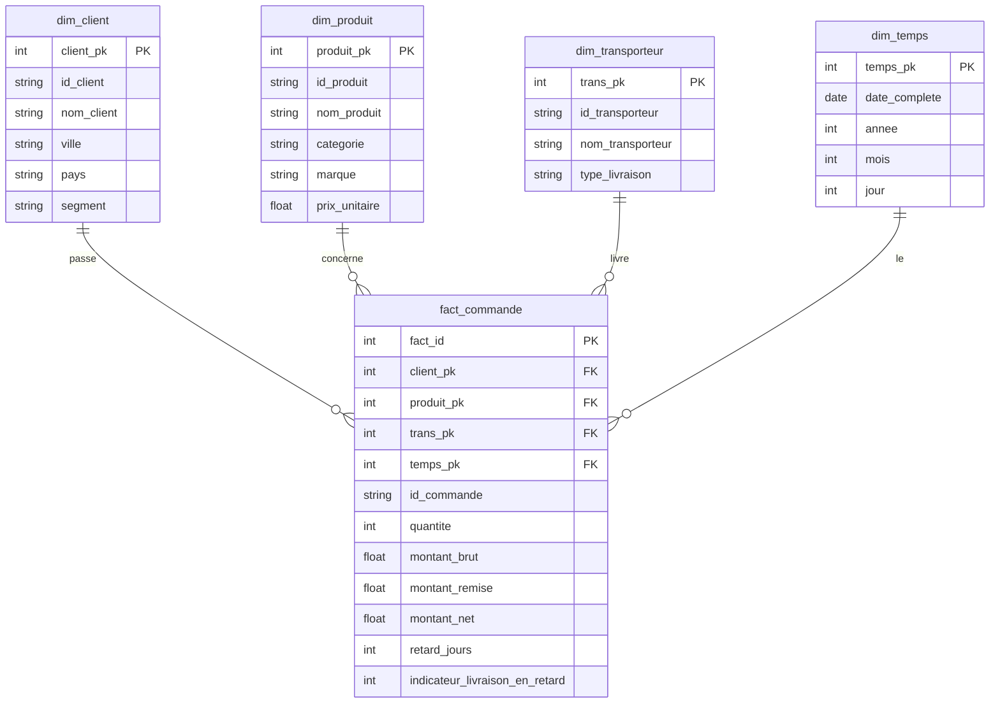
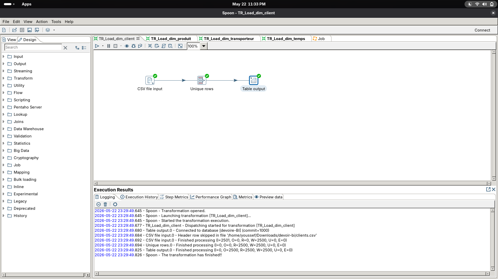
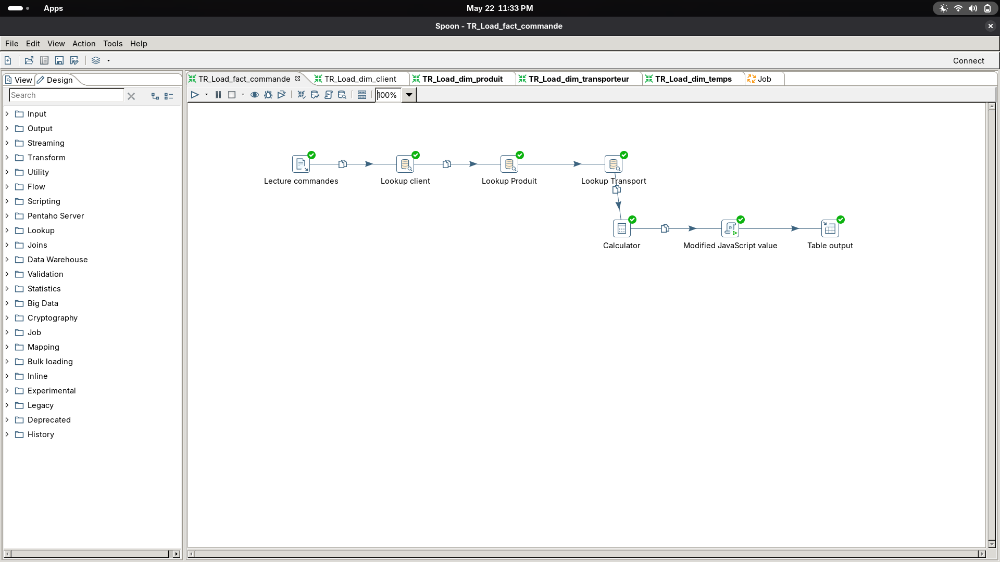
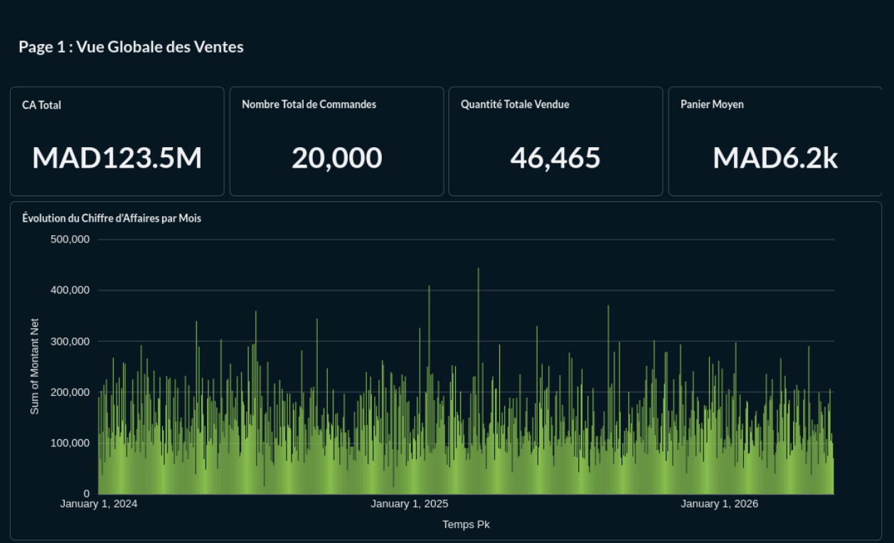
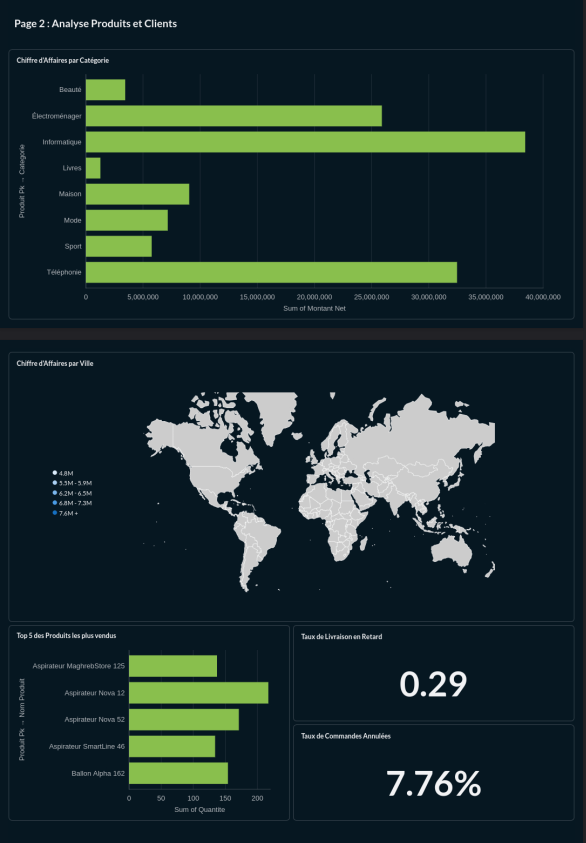
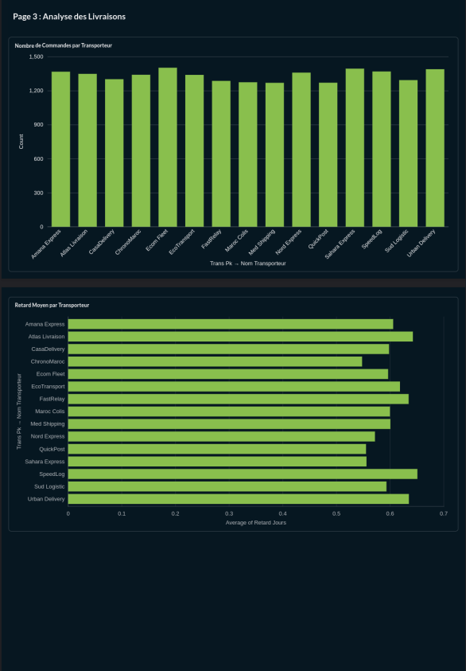

# RAPPORT DE PROJET : IMPLÉMENTATION D’UNE CHAÎNE DÉCISIONNELLE BI

**Module :** Business Intelligence  
**Étudiant :** Youssef Fellah  
**Environnement technique :** Fedora 44, PostgreSQL (Docker), Pentaho Data Integration (Spoon 11), Metabase  

---

## 1. Analyse du besoin décisionnel & Proposition des KPI (Tâches 1 & 2)

### 1.1 Objectif principal
L'objectif majeur de cette solution BI est de centraliser, nettoyer et modéliser les données éparses d'une plateforme e-commerce afin de fournir une visibilité transverse sur les performances commerciales (ventes) et opérationnelles (logistique et livraisons).

### 1.2 Limites des bases opérationnelles (OLTP) vs Solutions BI (OLAP)
Une base de données de production classique (OLTP) est optimisée pour l'écriture rapide et la gestion des transactions quotidiennes (insertions, mises à jour). Elle présente une structure hautement normalisée qui rend les requêtes analytiques globales extrêmement lourdes, risquant de saturer le serveur de production. Une solution BI repose sur un modèle dénormalisé (OLAP) dédié exclusivement à la performance des requêtes décisionnelles et à l'historisation des données.

### 1.3 Matrice des indicateurs clés (KPI) retenus
Conformément aux exigences du cahier des charges, 8 KPI fondamentaux ont été implémentés :

* **Chiffre d’Affaires (CA) Total :** Somme du montant net de l'ensemble des ventes.
* **Nombre Total de Commandes :** Volume global de transactions enregistrées.
* **Quantité Totale Vendue :** Cumul des unités de produits écoulées.
* **Panier Moyen :** Valeur financière moyenne d'une commande passée.
* **Chiffre d'Affaires par Catégorie / Ville :** Répartition de la valeur selon les axes produit et client.
* **Taux de Commandes Annulées :** Proportion de commandes n'aboutissant pas.
* **Taux de Livraison en Retard :** Ratio des commandes dont la date de livraison réelle dépasse l'engagement prévu.
* **Retard Moyen de Livraison :** Nombre moyen de jours de décalage pour les livraisons hors délais.

---

## 2. Conception & Modélisation du Data Warehouse (Tâches 3 & 4)

Afin d'optimiser l'exécution des requêtes sur Metabase, nous avons opté pour une **modélisation en étoile**.

### 2.1 Schéma logique et Diagramme ER



### 2.2 Implémentation SQL (PostgreSQL)

Voici le script de création des tables utilisé pour initialiser l'entrepôt de données :

```sql
-- Dimension Client
CREATE TABLE dim_client (
    client_pk SERIAL PRIMARY KEY,
    id_client VARCHAR(50) NOT NULL,
    nom_client VARCHAR(150),
    ville VARCHAR(100),
    pays VARCHAR(100),
    segment VARCHAR(50),
    CONSTRAINT uq_dim_client_id UNIQUE (id_client)
);

-- Dimension Produit
CREATE TABLE dim_produit (
    produit_pk SERIAL PRIMARY KEY,
    id_produit VARCHAR(50) NOT NULL,
    nom_produit VARCHAR(255),
    categorie VARCHAR(100),
    marque VARCHAR(100),
    prix_unitaire NUMERIC(12, 2),
    CONSTRAINT uq_dim_produit_id UNIQUE (id_produit)
);

-- Dimension Transporteur
CREATE TABLE dim_transporteur (
    trans_pk SERIAL PRIMARY KEY,
    id_transporteur VARCHAR(50) NOT NULL,
    nom_transporteur VARCHAR(150),
    type_livraison VARCHAR(50),
    CONSTRAINT uq_dim_trans_id UNIQUE (id_transporteur)
);

-- Dimension Temps
CREATE TABLE dim_temps (
    temps_pk INT PRIMARY KEY,
    date_complete DATE NOT NULL,
    annee INT NOT NULL,
    mois INT NOT NULL,
    nom_mois VARCHAR(20),
    jour INT NOT NULL,
    CONSTRAINT uq_dim_temps_date UNIQUE (date_complete)
);

-- Table de Faits
CREATE TABLE fact_commande (
    fact_id SERIAL PRIMARY KEY,
    client_pk INT NOT NULL,
    produit_pk INT NOT NULL,
    trans_pk INT NOT NULL,
    temps_pk INT NOT NULL,
    id_commande VARCHAR(50) NOT NULL,
    statut_commande VARCHAR(50),
    quantite INT NOT NULL,
    montant_brut NUMERIC(12, 2) NOT NULL,
    montant_remise NUMERIC(12, 2) NOT NULL,
    montant_net NUMERIC(12, 2) NOT NULL,
    retard_jours INT NOT NULL,
    indicateur_livraison_en_retard INT NOT NULL,
    CONSTRAINT fk_fact_client FOREIGN KEY (client_pk) REFERENCES dim_client(client_pk),
    CONSTRAINT fk_fact_produit FOREIGN KEY (produit_pk) REFERENCES dim_produit(produit_pk),
    CONSTRAINT fk_fact_trans FOREIGN KEY (trans_pk) REFERENCES dim_transporteur(trans_pk),
    CONSTRAINT fk_fact_temps FOREIGN KEY (temps_pk) REFERENCES dim_temps(temps_pk)
);

-- Indexation pour la performance
CREATE INDEX idx_fact_client ON fact_commande(client_pk);
CREATE INDEX idx_fact_produit ON fact_commande(produit_pk);
CREATE INDEX idx_fact_trans ON fact_commande(trans_pk);
CREATE INDEX idx_fact_temps ON fact_commande(temps_pk);
```

---

## 3. Implémentation du Processus ETL avec Pentaho (Tâches 5, 6 & 7)

### 3.1 Alimentation des Dimensions
Les transformations extraient les données des CSV, appliquent un nettoyage (Unique rows) et chargent PostgreSQL.



### 3.2 Alimentation de la Table de Faits (`TR_Load_fact_commande.ktr`)
Cette brique effectue les jointures d'intégrité et les calculs métiers :
* $$Montant~Net = (Quantité \times Prix~Unitaire) - Remise$$
* $$Retard = Date~Réelle - Date~Prévue$$



---

## 4. Audit, Validation & Requêtes de Contrôle SQL (Tâche 8)

Audit des volumes :
* `dim_client` : 2 500 enregistrements uniques.
* `fact_commande` : 20 000 transactions insérées sans rejet.

---

## 5. Analyse Décisionnelle & Restitution (Tâches 9, 10 & 11)

Le Data Warehouse a été connecté à **Metabase**.

### 5.1 Vue Globale et Commerciale (Page 1)
La plateforme génère un **CA Total de 123,5 Millions de MAD** avec un panier moyen de **6 200 MAD**.



### 5.2 Rentabilité et Segmentation (Page 2)
L'Informatique domine le CA (38M MAD). Les grandes villes concentrent l'essentiel des achats.



### 5.3 Qualité Logistique (Page 3)
Point critique : **29% de taux de retard**. Les transporteurs ont un retard moyen de ~0,6 jour.



### 5.4 Recommandations stratégiques
* **Logistique** : Renégocier les contrats avec *Atlas Livraison* et *SpeedLog* suite aux 30% de retards constatés.
* **Marketing** : Prioriser les segments *Informatique* et *Téléphonie*.
* **Conversion** : Analyser les 7,76% d'annulations pour optimiser le stock.

---

## Conclusion
Ce projet démontre l'efficacité d'une chaîne BI complète (Pentaho/PostgreSQL/Metabase) pour transformer des données brutes en leviers de croissance stratégiques.
